---
## Front matter
title: "Лабораторная работа №2"
subtitle: "Система контроля версий Git"
author: "Богату Ирина Владимировна"

## Generic otions
lang: ru-RU
toc-title: "Содержание"

## Bibliography
bibliography: bib/cite.bib
csl: pandoc/csl/gost-r-7-0-5-2008-numeric.csl

## Pdf output format
toc: true # Table of contents
toc-depth: 2
lof: true # List of figures
lot: true # List of tables
fontsize: 12pt
linestretch: 1.5
papersize: a4
documentclass: scrreprt
## I18n polyglossia
polyglossia-lang:
  name: russian
  options:
	- spelling=modern
	- babelshorthands=true
polyglossia-otherlangs:
  name: english
## I18n babel
babel-lang: russian
babel-otherlangs: english
## Fonts
mainfont: PT Serif
romanfont: PT Serif
sansfont: PT Sans
monofont: PT Mono
mainfontoptions: Ligatures=TeX
romanfontoptions: Ligatures=TeX
sansfontoptions: Ligatures=TeX,Scale=MatchLowercase
monofontoptions: Scale=MatchLowercase,Scale=0.9
## Biblatex
biblatex: true
biblio-style: "gost-numeric"
biblatexoptions:
  - parentracker=true
  - backend=biber
  - hyperref=auto
  - language=auto
  - autolang=other*
  - citestyle=gost-numeric
## Pandoc-crossref LaTeX customization
figureTitle: "Рис."
tableTitle: "Таблица"
listingTitle: "Листинг"
lofTitle: "Список иллюстраций"
lotTitle: "Список таблиц"
lolTitle: "Листинги"
## Misc options
indent: true
header-includes:
  - \usepackage{indentfirst}
  - \usepackage{float} # keep figures where there are in the text
  - \floatplacement{figure}{H} # keep figures where there are in the text
---

# Цель работы

Цели работы - приобрести навыки по работе с системой контроля версий git и научиться пользоваться онлайн платформой GitHub. 

# Выполнение лабораторной работы

Перед началом работы с git его необходимо предварительно настроить. Для этого введем в терминал следующие команды (рис. 2.1):

Введя их, мы задали имя и электронный адрес почты пользователя.
Теперь введем следующую команду (рис. 2.2):

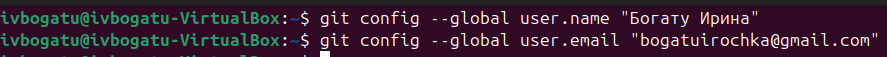

Благодаря ней, мы настроили вывод сообщений git в кодировке utf8.
Теперь мы должны задать имя для начальной ветки. Мы назовем ее master (рис. 2.3): 

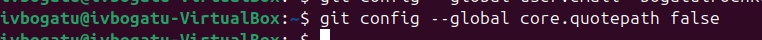

Теперь введем следующую команду (рис. 2.4)

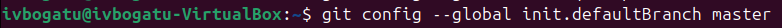

Таким образом мы указываем git автоматически конвертировать CRLF окончания строк в LF во время commit'а.
Теперь выполним вот эту команду (рис. 2.5). Она будет отвечать за то, чтобы печатать предупреждение в случае, если преобразования из CRLF будут необратимыми.

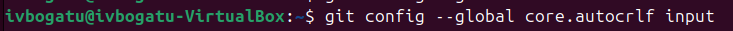

Для того, чтобы сервер мог идентифицировать пользователя, необходимо сгенерировать несколько ssh ключей. Начнем с генерации открытого ключа. Для этого мы введем следующую команду, указав имя, фамилию пользователя и его адрес электронной почты в качестве аргумента (рис. 2.6)

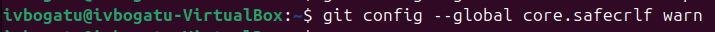

Зайдем на сайт GitHub (рис. 2.7)

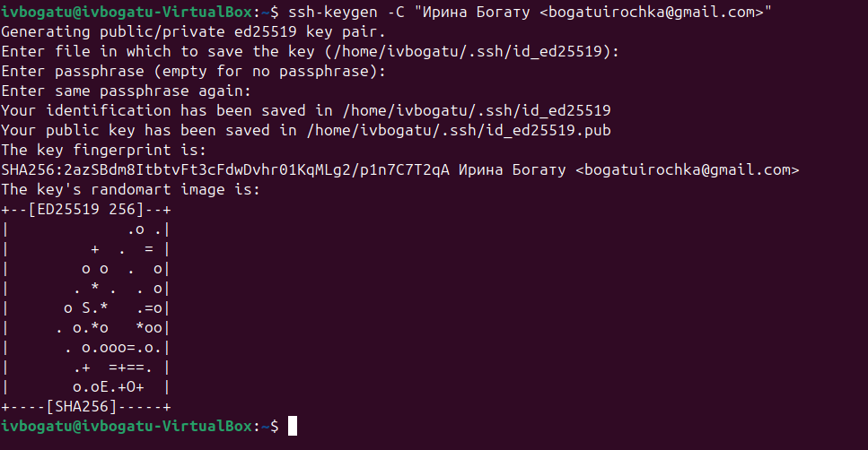

Здесь мы должны перейти в пункт settings (рис. 2.8)

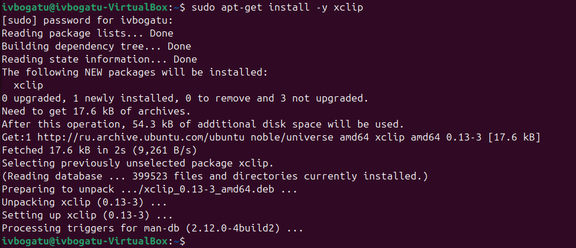

Находим раздел SSH and GPG keys и нажимаем New SSH key (рис. 2.9)

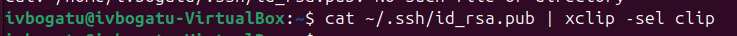

В предложенное поле "Key" нам необходимо вставить ключ, который мы только что сгенерировали (рис. 2.10)

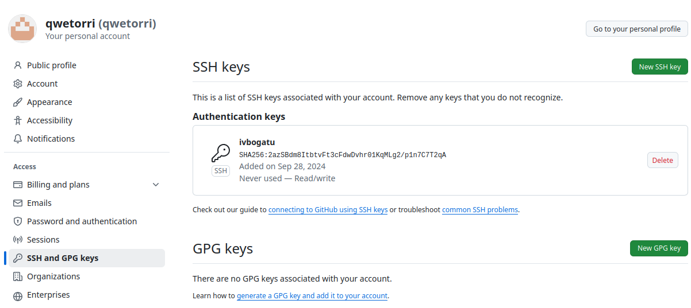

Для того, чтобы скопировать ключ для последующей вставки, нам необходимо ввести следующую команду (рис. 2.11)

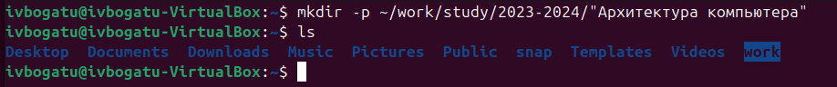

Команда "cat" прочитает данные из файла id_rsa.pub, а команда xclip вгрузит их в буфер обмена.
Остается лишь вставить содержимое буфера обмена, то есть наш ключ, в предложенное поле "Key" и указать имя ключа в поле "Title" (рис. 2.12)

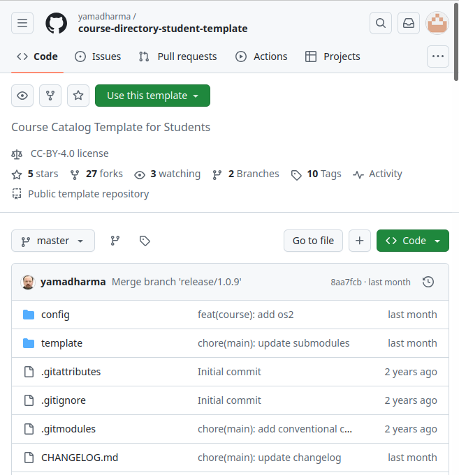

Теперь нам необходимо организовать наше рабочее пространство. Для этого создадим каталог "Архитектура компьютера" по следующему адресу (рис. 2.13)

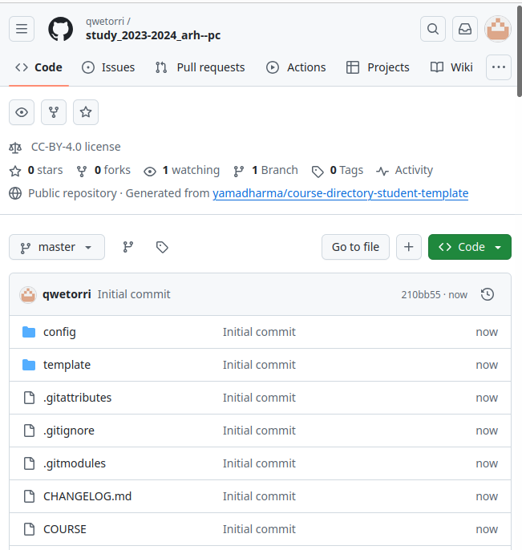

После этого нам нужно будет создать репозиторий. Мы будем его создавать на основе шаблона, который находится по следующему адресу: https://github.com/yamadharma/course-directory-student-template (рис. 14)

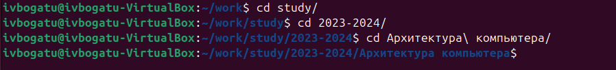

Нажимаем на кнопку "Use this template", и в предложенных опциях выбираем "Create new repository". Далее нас переносит на следующую страницу (рис. 2.15). Здесь задаём имя нашего репозитория. Он будет называться так: study_2023-2024_arh-pc

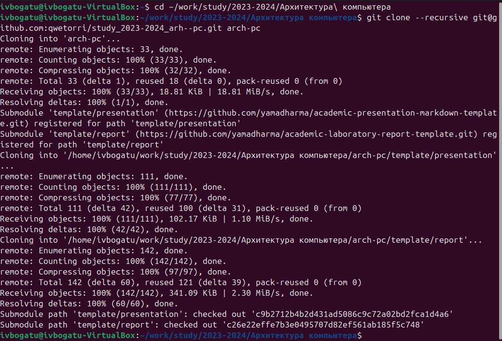

Теперь нам нужно клонировать репозиторий на наш компьютер. Для этого перейдем в папку, в которую мы хотим скопировать репозиторий. В нашем случае это ранее созданная папка (рис. 2.16)

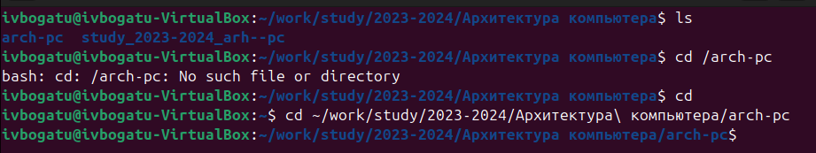

Теперь перейдем непосредственно к клонированию. Для этого воспользуемся командой git clone, в аргументе указав ссылку на репозиторий (рис. 2.17). Ссылку можно найти при нажатии на кнопку код на странице нашего репозитория (рис. 2.18)

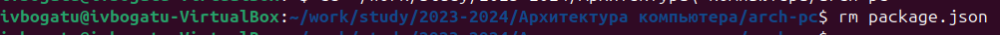

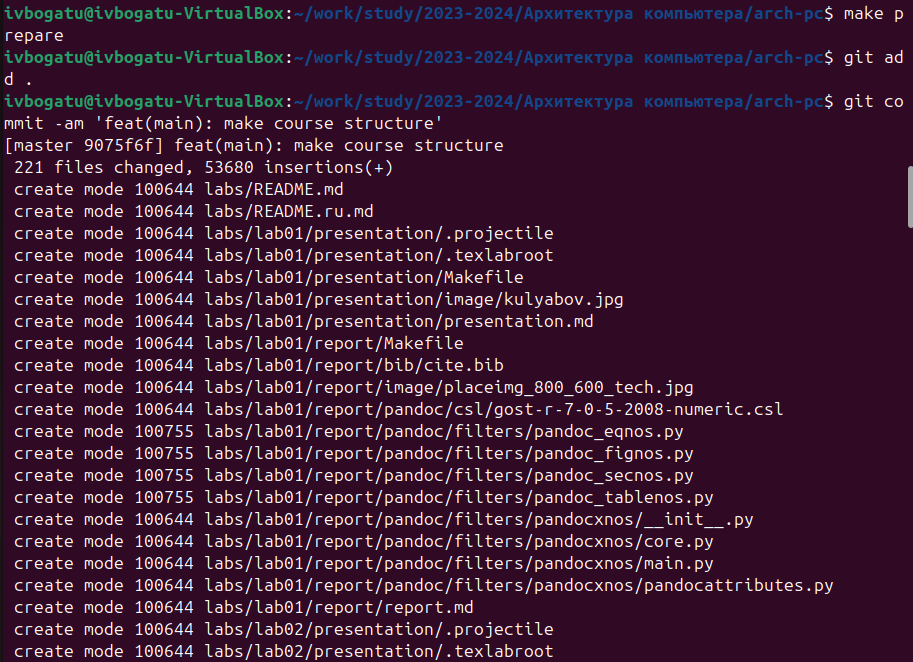

Теперь перейдем к настройке клонированного каталога. Для начала перейдем в него с помощью команды "cd" (рис. 2.19).

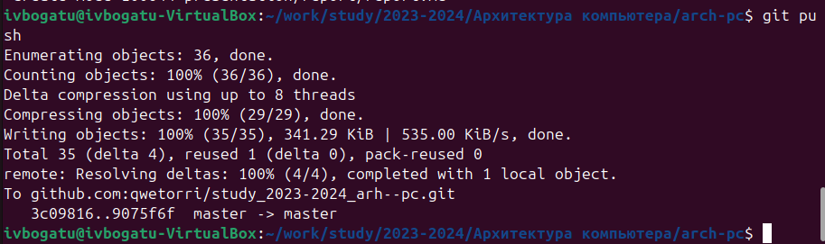

Удалим с помощью команды "rm" лишний файл (рис. 2.20)

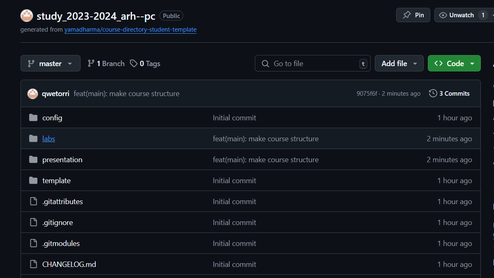

Теперь создадим необходимые файлы. В нашем случае, это будет файл COURSE. Чтобы его создать, мы воспользуемся командой echo, которая запишет в файл строку "acrh-pc" и автоматически создаст его, т.к. этого файла раньше не существовало (рис. 2.21)

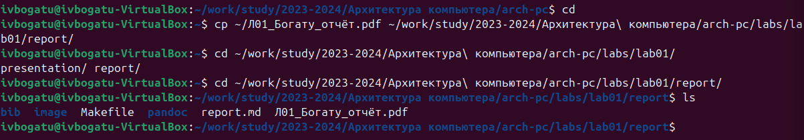

Теперь нам остается лишь отправить файлы на сервер. Для этого с помощью команды git add мы добавим каталоги, которые должны отправляться на сервер. В качестве аргумента мы возьмем точку, которая укажет на то, что мы должны отправить на сервер все файлы и каталоги, которые по иерархии находятся ниже нашего текущего расположения (рис. 2.22)

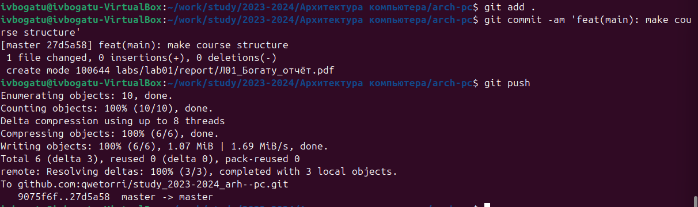

Теперь с помощью команды git commit мы сохраним изменения и укажем комментарий, в котором будет поясняться, какие изменения мы сделали. В данном случае в комментарии мы напишем, что создали структуру курса (рис. 2.23)

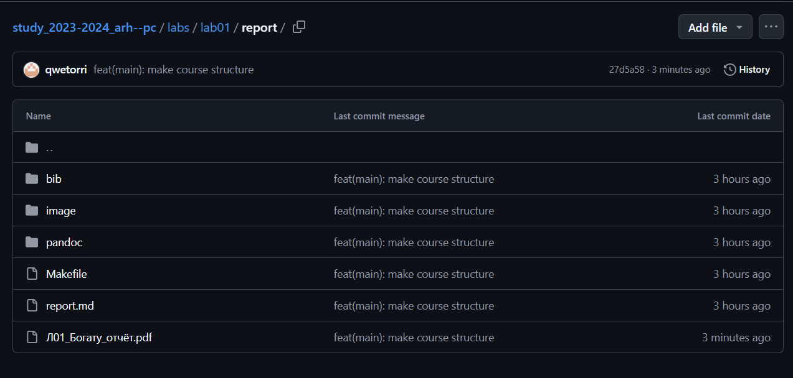

Теперь нам осталось окончательно загрузить изменения на сервер. Для этого мы воспользуемся командой git push (рис. 2.24)

Остается лишь проверить, сохранились ли файлы на сервере. Сравним файлы, которые находятся на GitHub с теми файлами, что находятся на нашем компьютере (рис. 2.25 и рис. 2.26)

Как видим, все совпало.

# Задание для самостоятельной работы

Теперь приступим к выполнению самостоятельной работы.
Для начала мы создадим файл отчета для нашей лабораторной работы в папке labs/lab02/report с помощью LibreOffice (рис. 3.1, рис. 3.2, рис. 3.3 и рис. 3.4)

После этого скопируем отчет по нашей предыдущей лабораторной работе в соответствующую папку созданного нами рабочего пространства, то есть в папку labs/lab01/report. Для копирования воспользуемся командой "cp" (рис. 3.4)

Теперь нам осталось лишь загрузить изменения на GitHub. Для этого нам нужно повторить те шаги, которые мы выполнили в предыдущих пунктах лабораторной работы, а именно, воспользоваться командой "git add ." для того, чтобы указать, что мы хотим сохранить изменения во всех файлах, находящихся в нашем каталоге (рис. 3.5)

После этого с помощью команды "git commit" мы укажем комментарий и сохраним изменения. В комментарии мы укажем, что мы загрузили первую и вторую лабораторные работы (рис. 3.6)

После этого вводим команду "git push" для того, чтобы загрузить наши файлы на GitHub (рис. 3.7)

Остается лишь проверить, правильно ли мы все загрузили. Для этого посмотрим время обновления файлов в папке labs в GitHub (рис. 3.8) 

# Выводы

В результате выполнения лабораторной работы появились практические навыки работы с системой контроля версий Git, была произведена её первоначальная настройка в linux. 
Было изучено, как создавать репозитории, сохранять изменения и добавлять к ним комментарии, а также как выгружать файлы на сервер. Были приобретены навыки работы с платформой GitHub
