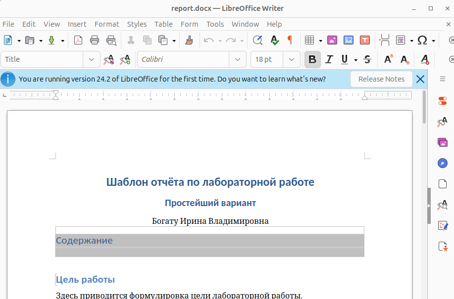
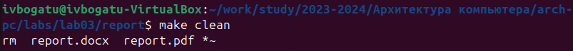
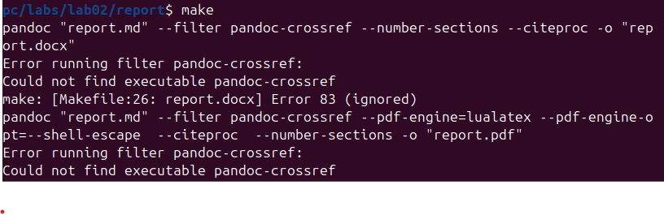

---
## Front matter
title: "Лабораторная работа №3"
subtitle: "Язык разметки Markdown"
author: "Богату Ирина Владимировна"

## Generic otions
lang: ru-RU
toc-title: "Содержание"

## Bibliography
bibliography: bib/cite.bib
csl: pandoc/csl/gost-r-7-0-5-2008-numeric.csl

## Pdf output format
toc: true # Table of contents
toc-depth: 2
lof: true # List of figures
lot: true # List of tables
fontsize: 12pt
linestretch: 1.5
papersize: a4
documentclass: scrreprt
## I18n polyglossia
polyglossia-lang:
  name: russian
  options:
	- spelling=modern
	- babelshorthands=true
polyglossia-otherlangs:
  name: english
## I18n babel
babel-lang: russian
babel-otherlangs: english
## Fonts
mainfont: PT Serif
romanfont: PT Serif
sansfont: PT Sans
monofont: PT Mono
mainfontoptions: Ligatures=TeX
romanfontoptions: Ligatures=TeX
sansfontoptions: Ligatures=TeX,Scale=MatchLowercase
monofontoptions: Scale=MatchLowercase,Scale=0.9
## Biblatex
biblatex: true
biblio-style: "gost-numeric"
biblatexoptions:
  - parentracker=true
  - backend=biber
  - hyperref=auto
  - language=auto
  - autolang=other*
  - citestyle=gost-numeric
## Pandoc-crossref LaTeX customization
figureTitle: "Рис."
tableTitle: "Таблица"
listingTitle: "Листинг"
lofTitle: "Список иллюстраций"
lotTitle: "Список таблиц"
lolTitle: "Листинги"
## Misc options
indent: true
header-includes:
  - \usepackage{indentfirst}
  - \usepackage{float} # keep figures where there are in the text
  - \floatplacement{figure}{H} # keep figures where there are in the text
---

# Цель работы

Целью работы является получение практических и теоретических навыков работы с языком разметки Markdown на примере оформления отчёта лабораторной работы

# Выполнение лабораторной работы

Для начала выполнения лабораторной работы нам необходимо открыть рерминал и переместиться в рабочий каталог (Рис. 2.1):

После этого нужно обновить локальный репозиторий с помощью команды git pull. Так мы синхронизируем файлы на компьютере с файлами на Github'е (Рис. 2.2):

Перейдём в каталог лабораторной работы номер 3 (Рис. 2.3):

Теперь проведём компиляцию шаблона отчёта с помощью команды make (Рис. 2.4)

Теперь проверим, создались ли файлы .docx и .pdf (Рис. 2.5 - 2.7)

Теперь попробуем удалить эти файлы. Для этого воспользуемся командой make clean (Рис. 2.8)

А теперь проверим, удалились ли файлы отчёта (Рис. 2.9)

Теперь откроем файл отчёта report.md с помощью редактора gedit (Рис. 2.10)

Теперь посмотрим, что из себя представляет файл report.md (Рис. 2.11)

После заполнения отчёта прописываем команду make, чтобы скомпилировать готовый отчёт (Рис. 2.12)

Теперь перейдём в рабочий каталог (Рис. 2.13)

Теперь с помощью git отправим файлы лабораторной работы на Github. В качестве комментария укажем, что мы добавляем файлы для третьей лабораторной работы (Рис. 2.14)

# Выполнение задания для самостоятельной работы

Теперь нам нужно переделать вторую лабораторную работу в формат Markdown. Для этого необходимо для начала перейти в каталог второй лабораторной работы (Рис. 3.1)

Откроем файл лабораторной работы с помощью gedit (Рис. 3.2)

Заполним титульную страницу (Рис. 3.3)

Заполним цель работы и пункт выполнения лабораторной работы (Рис. 3.4)

Напишем в отчёте задание для самостоятельной работы (Рис. 3.5)

И заполним выводы (Рис. 3.6)

Также, поместим скриншоты в отдельную папку image (Рис. 3.7)

Теперь соберём отчёт с помощью команды make (Рис. 3.8)

Теперь осталось отправить файлы на Github. Для этого сначала перейдём в рабочий каталог (Рис. 3.9)

И после этого используем Git Для отправки. В комментарии укажем, что добавляем файлы для лабораторной работы номер 2 (Рис. 3.10-3.11)

# Выводы
