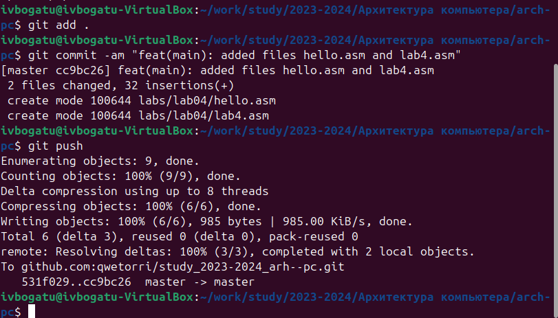

---
## Front matter
title: "Лабораторная работа №4"
subtitle: "Создание и процесс обработки программ на языке ассемблера NASM"
author: "Богату Ирина Владимировна"

## Generic otions
lang: ru-RU
toc-title: "Содержание"

## Bibliography
bibliography: bib/cite.bib
csl: pandoc/csl/gost-r-7-0-5-2008-numeric.csl

## Pdf output format
toc: true # Table of contents
toc-depth: 2
lof: true # List of figures
lot: true # List of tables
fontsize: 12pt
linestretch: 1.5
papersize: a4
documentclass: scrreprt
## I18n polyglossia
polyglossia-lang:
  name: russian
  options:
	- spelling=modern
	- babelshorthands=true
polyglossia-otherlangs:
  name: english
## I18n babel
babel-lang: russian
babel-otherlangs: english
## Fonts
mainfont: PT Serif
romanfont: PT Serif
sansfont: PT Sans
monofont: PT Mono
mainfontoptions: Ligatures=TeX
romanfontoptions: Ligatures=TeX
sansfontoptions: Ligatures=TeX,Scale=MatchLowercase
monofontoptions: Scale=MatchLowercase,Scale=0.9
## Biblatex
biblatex: true
biblio-style: "gost-numeric"
biblatexoptions:
  - parentracker=true
  - backend=biber
  - hyperref=auto
  - language=auto
  - autolang=other*
  - citestyle=gost-numeric
## Pandoc-crossref LaTeX customization
figureTitle: "Рис."
tableTitle: "Таблица"
listingTitle: "Листинг"
lofTitle: "Список иллюстраций"
lotTitle: "Список таблиц"
lolTitle: "Листинги"
## Misc options
indent: true
header-includes:
  - \usepackage{indentfirst}
  - \usepackage{float} # keep figures where there are in the text
  - \floatplacement{figure}{H} # keep figures where there are in the text
---

# Цель работы

Научиться писать базовые программы на языке ассемблера NASM, компилировать их в объектные файлы и собирать из них исполняемые программы с помощью компановщика.

# Выполнение лабораторной работы

Перед выполнением лабораторной работы необходимо создать нужную директорию с помощью команды mkdir (Рис. 2.1):

Теперь переместимся в созданный нами каталог (Рис. 2.2):

Теперь создадим файл hello с расширением .asm, в котором мы будем писать код на ассемблере (Рис. 2.3):

Для того, чтобы редактировать созданный файл, воспользуемся текстовым редактором gedit (Рис. 2.4):

Вставим в открытый файл следующий код (Рис. 2.5):

Теперь нам необходимо превратить наш файл в объектный. Этим занимается транслятор NASM. Введём следующую команду (Рис. 2.6):

Здесь мы говорим создать из файла hello.asm объектный, указывая при этом формат файла elf (с помощью аргумента -f), то есть формат, работающий в системах семейства Linux. 
Далее проверим, создался ли объектный файл с помощью команды ls (Рис. 2.7):

Теперь попробуем использовать полный вариант команды NASM (Рис. 2.8):

Здесь мы указываем, что файл hello.asm должен быть скомпилирован в файл с названием obj.o (название указывается с помощью аргумента -o) в формате elf (аргументом -f) и включить туда символы для отладки (аргумент -g). Кроме того, мы укажем, что необходимо создать файл листинга list.lst (аргументом -l). 
Проверим, создался ли файл с помощью команды ls (Рис. 2.9):

Для создания исполняемого файла необходимо использовать компоновщик ld, который соберёт объектный файл. Напишем следующую команду (Рис. 2.10):

Здесь мы указываем формат elf_i386 (с помощью аргумента -m) и файл для сборки, а аргументом -o указываем имя выходного файла. Мы назовём его hello.
Проверим, создался ли файл с помощью команды cd (Рис. 2.11):

Теперь соберём файл obj.o в файл main (Рис. 2.12):

Теперь проверим, создался ли файл. Снова пропишем команду cd (Рис. 2.13):

Теперь запустим файл hello, для этого мы должны написать ./ и название файла (Рис. 2.14):

# Выполнение задания для самостоятельной работы

Скопируем файл hello.asm в каталог ~/work/arch-pc/lab04 под названием lab4.asm (Рис. 3.1):

Внесём изменения в скопированный файл. Для этого откроем его в gedit (Рис. 3.2):

Теперь изменим третью строчку, заменив фразу Hello world! на фамилию и имя (Рис. 3.3):

Теперь скомпилируем полученный файл в объектный. Для этого воспользуемся командой nasm и укажем формат elf и нужный файл для компиляции (Рис. 3.4):

Теперь соберём полученный объектный файл. Укажем формат elf_i386 и объектный файл для сборки (lab4.o). Укажем, что выходной файл должен быть назван lab4 (Рис. 3.5):

Убедимся в том, что сделали всё правильно. Для этого запустим собранный файл (Рис. 3.6):

Теперь скопируем файл hello.asm в каталог 4 лабораторной работы (Рис. 3.7):

Эту же операцию проведём для файла lab4.asm (Рис. 3.8):

Теперь загрузим результат проделанной лабораторной работы на GitHub (Рис. 3.9):

# Выводы

В результате выполнения лабораторной работы появилось понимание того, как работает алгоритм создания исполняемого файла из кода на ассемблере, а также появились навыки работы с языком nasm, компиляции кода в объектный файл и сборкой исполняемых программ.

