---
## Front matter
title: "Лабораторная работа №5"
subtitle: "Основы работы с Midnight Commander (mc). Структура программы на языке ассемблера NASM. Системные вызовы в ОС GNU Linux"
author: "Богату Ирина Владимировна"

## Generic otions
lang: ru-RU
toc-title: "Содержание"

## Bibliography
bibliography: bib/cite.bib
csl: pandoc/csl/gost-r-7-0-5-2008-numeric.csl

## Pdf output format
toc: true # Table of contents
toc-depth: 2
lof: true # List of figures
lot: true # List of tables
fontsize: 12pt
linestretch: 1.5
papersize: a4
documentclass: scrreprt
## I18n polyglossia
polyglossia-lang:
  name: russian
  options:
	- spelling=modern
	- babelshorthands=true
polyglossia-otherlangs:
  name: english
## I18n babel
babel-lang: russian
babel-otherlangs: english
## Fonts
mainfont: PT Serif
romanfont: PT Serif
sansfont: PT Sans
monofont: PT Mono
mainfontoptions: Ligatures=TeX
romanfontoptions: Ligatures=TeX
sansfontoptions: Ligatures=TeX,Scale=MatchLowercase
monofontoptions: Scale=MatchLowercase,Scale=0.9
## Biblatex
biblatex: true
biblio-style: "gost-numeric"
biblatexoptions:
  - parentracker=true
  - backend=biber
  - hyperref=auto
  - language=auto
  - autolang=other*
  - citestyle=gost-numeric
## Pandoc-crossref LaTeX customization
figureTitle: "Рис."
tableTitle: "Таблица"
listingTitle: "Листинг"
lofTitle: "Список иллюстраций"
lotTitle: "Список таблиц"
lolTitle: "Листинги"
## Misc options
indent: true
header-includes:
  - \usepackage{indentfirst}
  - \usepackage{float} # keep figures where there are in the text
  - \floatplacement{figure}{H} # keep figures where there are in the text
---

# Цель работы

Ознакомиться с программой Midnight commander и освоить написание программ на языке ассемблера с помощью инструкций mov и int

# Выполнение лабораторной работы

Для начала выполнения лабораторной работы нам необходимо открыть Midnight commander с помощью команды mc (Рис. 2.1):

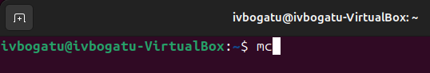

После ввода команды мы увидим такой интерфейс (Рис. 2.2):

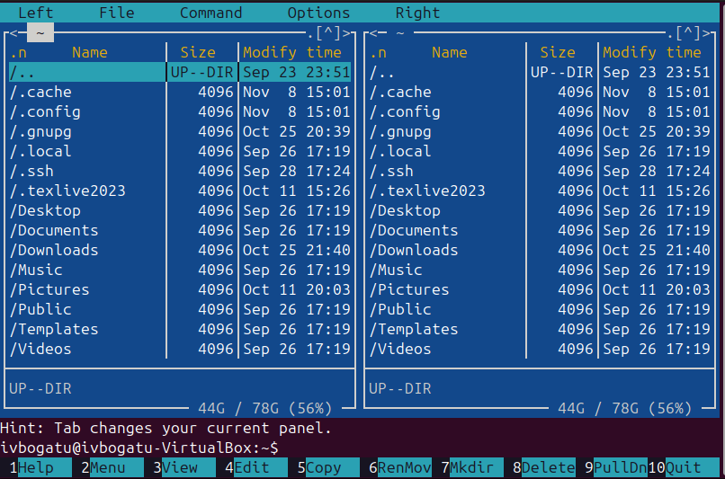

С помощью стрелок и клавиши Enter перейдём в каталог ~/work/arch-pc (Рис. 2.3):

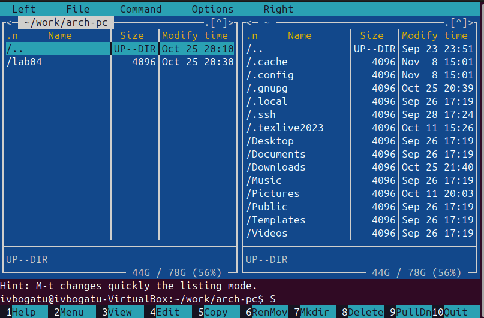

Создадим папку lab05 с помощью клавиши F7 (Рис. 2.4):

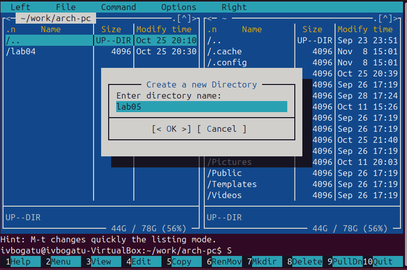

Теперь с помощью команды touch создадим файл lab5-1.asm (Рис. 2.5):

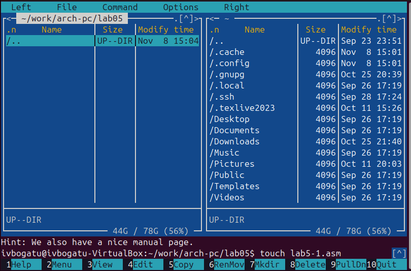

Теперь с помощью клавиши F4 откроем только что созданный файл. Нам предложат выбор между несколькими редакторами. Мы выберем редактор по умолчанию, nano (Рис. 2.6):

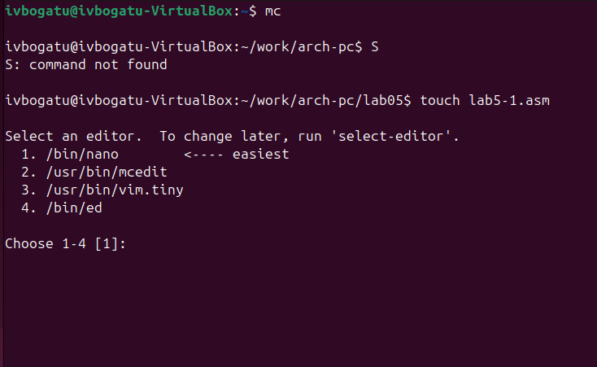

Теперь отредактируем файл и поместим в него следующий код (Рис. 2.7):

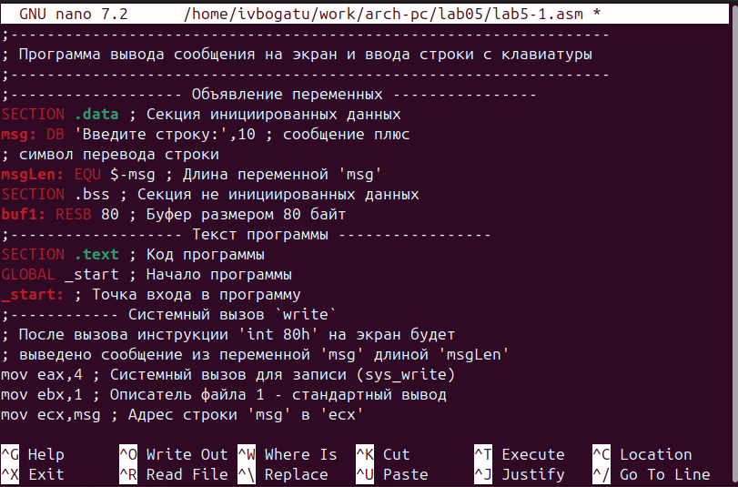

Теперь сохраним его (сочетанием клавиш ctrl+x и согласившись с сохранением) и с помощью F3 откроем для просмотра, чтобы убедиться, что он сохранился корректно (Рис. 2.8):

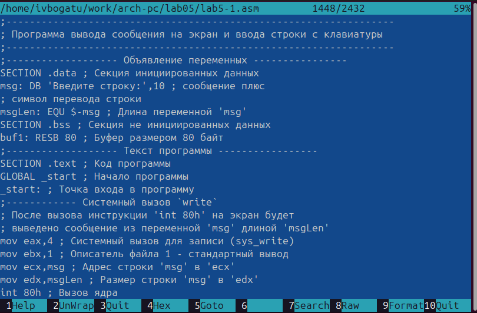

Теперь скомпилируем его (Рис. 2.9):

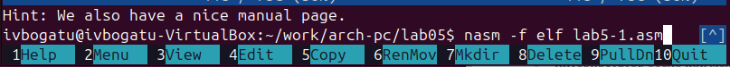

И соберём (Рис. 2.10):

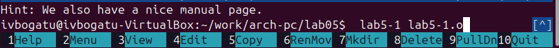

После этого запустим получившийся исполняемый файл (Рис. 2.11):

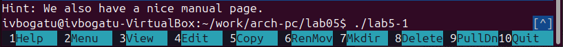

Теперь введём ФИО (Рис. 2.12):

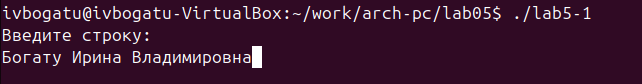

После нажатия Enter программа завершится и ничего не произойдёт. Теперь скачаем файл in_out.asm и откроем папку с ним в правой панели (Рис. 2.13):

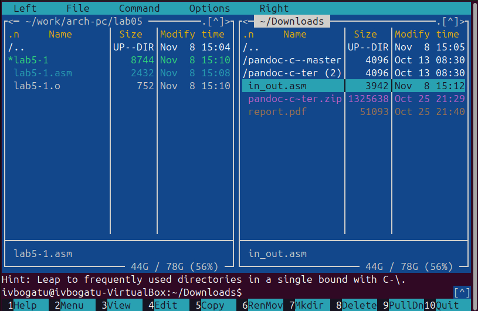

Скопируем его в нашу рабочую папку с помощью F6 (Рис. 2.14):

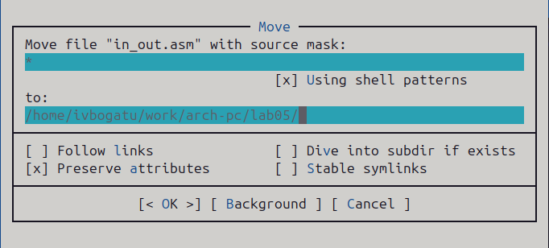

Теперь сделаем копию файла lab5-1.asm с помощью команды F5. Назовём копию lab5-2.asm (Рис. 2.15):

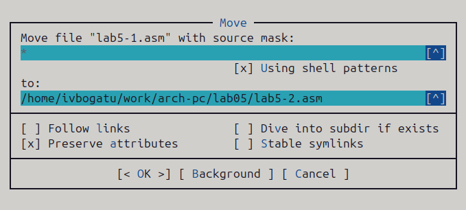

Теперь наша папка выглядит следующим образом (Рис. 2.16):

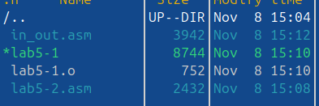

Откроем в текстовом редакторе файл lab5-2.asm и напишем туда следующий код (Рис. 2.17):

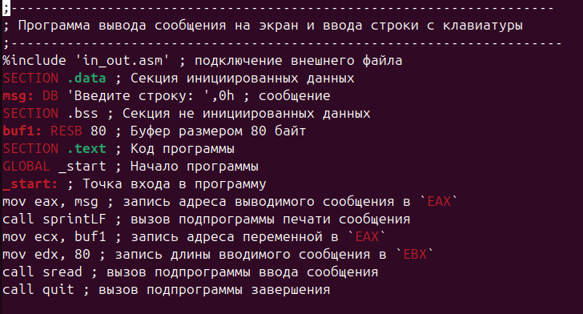

После чего создадим исполняемый файл с помощью nasm и ld (Рис. 2.18):

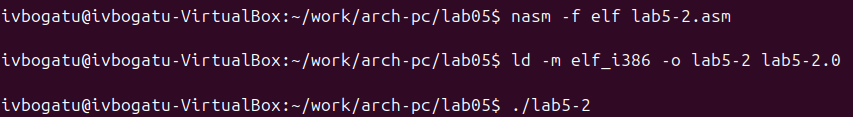

Запустим созданный файл (Рис. 2.19):

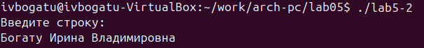

Он работает также, как и файл lab5-1, но использует для работы сторонний файл. Попробуем теперь вместо команды sprintLF использовать просто команду sprint (Рис. 2.20):

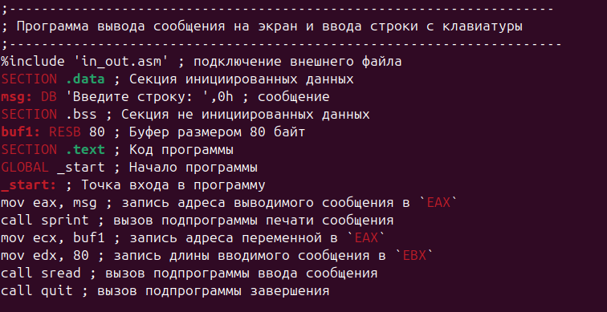

Точно также соберём исполняемый файл и запустим его (Рис. 2.21):

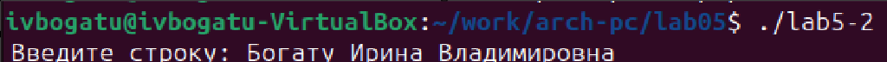

Как мы видим, теперь нет переноса на следующую строку. Этим и отличаются команды sprintLF от sprint. Первая добавляет перенос после текста, а вторая нет

# Выполнение задания для самостоятельной работы

Теперь создадим с помощью F6 копию файла lab5-1.asm (Рис. 3.1):

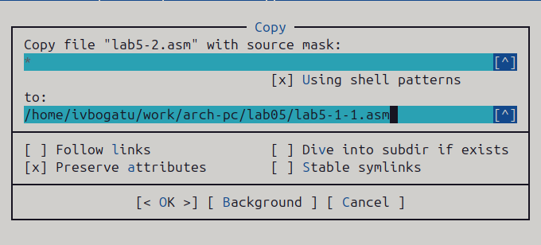

Изменим копию так, чтобы она выводила тот текст, который получила на ввод. Для этого перед системным вызовом exit вставим текст с системным вызовом write. Он очень похож на системный вызов write, который уже был в коде, но есть несколько отличий. Так, мы перемещаем адрес строки buf1 в ecx и размер строки buf1 (80) в edx (Рис. 3.2):

Сохраним изменения и создадим исполняемый файл (Рис. 3.3):

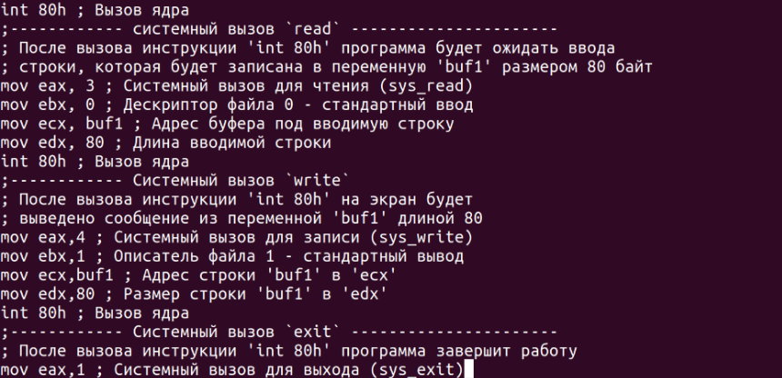

Запустим его и проверим, что всё работает (Рис. 3.4):

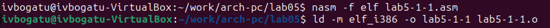

Теперь создадим с помощью F5 копию файла lab5-2.asm (Рис. 3.5):

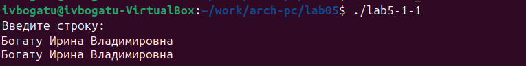

теперь сделаем так, чтобы этот код также выводил тот текст, что получит на ввод. Для этого перед последней строкой добавим строчку, которая записывает в eax адрес buf1, а также строчку, которая вызывает подпрограмму sprintLF (Рис. 3.6):

Теперь создадим исполняемый файл (Рис. 3.7):

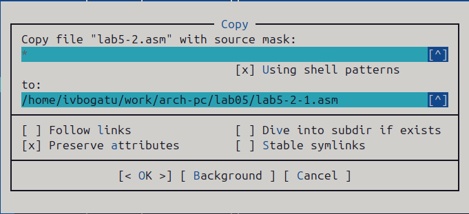

Теперь запустим программу и убедимся, что она работает (Рис. 3.8):

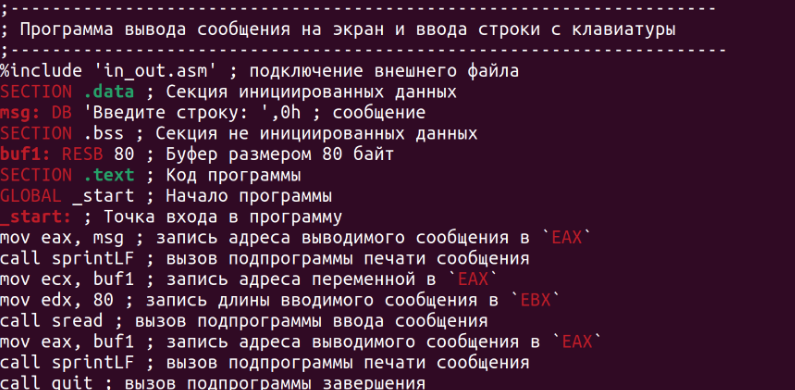

# Выводы

В результате выполнения работы были получены навыки работы с Midnight commander, а также навыки написания простых программ ввода-вывода на языке ассемблера

